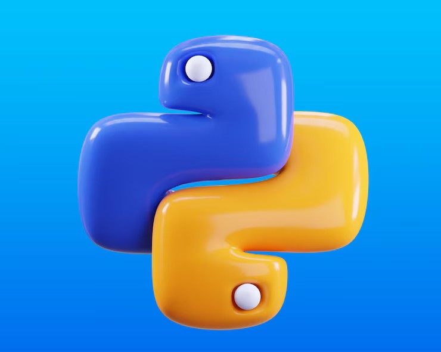

# OOP — Summary

You made it. 🏆

From `print('Hello World!')` to building your own classes with inheritance — that's a full arc. Let's wrap up OOP and the whole journey.

---

# Chapter 13 Recap

- A **class** is a blueprint. An **object** is an instance of that blueprint.
- `__init__` is the constructor — runs when you create an instance.
- `self` refers to the current instance — always the first parameter of any method.
- **Instance attributes** are set with `self.attribute = value`
- **Instance methods** define behavior — always take `self` as the first argument.
- `__str__` controls how `print(object)` formats the output.
- **Inheritance**: `class Child(Parent)` — inherits all parent attributes and methods.
- `super().__init__(...)` calls the parent constructor from the child.

---

# OOP Vocabulary Table

| Term | Python keyword/syntax | What it means |
|------|-----------------------|---------------|
| Class | `class ClassName:` | The blueprint |
| Object / Instance | `obj = ClassName()` | A specific thing built from the blueprint |
| Constructor | `def __init__(self, ...)` | Runs when creating an instance |
| Self | `self` | Refers to the current instance |
| Attribute | `self.name = value` | Data stored on the object |
| Method | `def my_method(self):` | Function that belongs to the class |
| Inheritance | `class Child(Parent):` | Child gets everything the parent has |
| Super | `super().__init__(...)` | Calls the parent's method |
| `__str__` | `def __str__(self):` | Controls `print(object)` output |
| Encapsulation | `self._private` | Convention for "don't touch from outside" |

---

## Instructions

Full-circle project: remember the ATM PIN from Chapter 4? 🏦

Build a `bank_account.py` program with a `BankAccount` class that has:

- **Attributes**: `owner`, `balance`
- **Method** `.deposit(amount)` — adds to balance, prints confirmation
- **Method** `.withdraw(amount)` — subtracts from balance, but refuses if it would go negative (print an error message instead)
- **Method** `.show_balance()` — prints the current balance
- **`__str__`** — returns a summary string

Create two accounts, make some deposits and withdrawals, and show the final balances.

## Solved Exercise:

```py
# bank_account.py

class BankAccount:
    def __init__(self, owner, balance=0):
        self.owner = owner
        self.balance = balance

    def deposit(self, amount):
        if amount <= 0:
            print('Deposit must be greater than zero.')
            return
        self.balance += amount
        print(f'${amount:,.2f} deposited. Balance: ${self.balance:,.2f}')

    def withdraw(self, amount):
        if amount > self.balance:
            print(f'Insufficient funds. Balance: ${self.balance:,.2f}')
        else:
            self.balance -= amount
            print(f'${amount:,.2f} withdrawn. Balance: ${self.balance:,.2f}')

    def show_balance(self):
        print(f'{self.owner}\'s balance: ${self.balance:,.2f}')

    def __str__(self):
        return f'BankAccount({self.owner}, ${self.balance:,.2f})'


# Create accounts
account1 = BankAccount('Valentina', 500)
account2 = BankAccount('Lucas')

account1.deposit(1500)
account1.withdraw(200)
account1.show_balance()

print()

account2.deposit(300)
account2.withdraw(500)   # should fail
account2.show_balance()

print(account1)
print(account2)

# Output:
# $1,500.00 deposited. Balance: $2,000.00
# $200.00 withdrawn. Balance: $1,800.00
# Valentina's balance: $1,800.00
#
# $300.00 deposited. Balance: $300.00
# Insufficient funds. Balance: $300.00
# Lucas's balance: $300.00
# BankAccount(Valentina, $1,800.00)
# BankAccount(Lucas, $300.00)
```

---

# 🐍 The Journey

You started with `print('Hello World!')` and made it here. Here's everything you covered:

| Chapter | Topic |
|---------|-------|
| 1 | Python Basics — print, comments |
| 2 | Variables — data types, operators, user input |
| 3 | Control Flow — if/elif/else, random, logical operators |
| 4 | Loops — while, for, f-strings, turtle graphics |
| 5 | First Project — Rock Paper Scissors |
| 6 | Lists — indexing, slicing, methods, iteration |
| 7 | Functions — def, parameters, return, scope |
| 8 | Dictionaries — key-value pairs, methods |
| 9 | Tuples & Sets — immutability, set math |
| 10 | String Methods — split, join, replace, validation |
| 11 | Error Handling — try/except, raise |
| 12 | File Handling — read, write, append |
| 13 | OOP — classes, methods, inheritance |

**What's next from here?**

- 🌐 **Web development** — Flask or Django
- 📊 **Data science** — Pandas, NumPy, Matplotlib
- 🤖 **AI/ML** — scikit-learn, PyTorch
- 🔌 **APIs** — `requests` library, building REST APIs
- 🎮 **Game dev** — Pygame

Every one of those paths starts exactly where you are right now.



Every expert was once a beginner. 🐍
