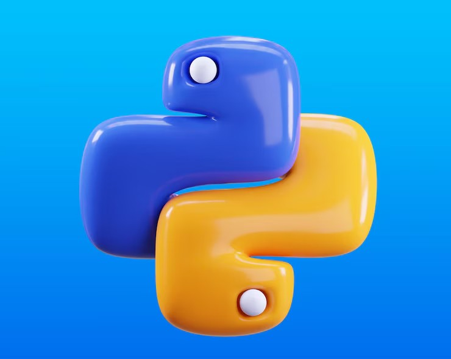

# Welcome to my first chapter learning Python! 🐍

The programming language Iam learning today is called Python, created by a developer named Guido van Rossum in the early 90s.

Python is designed to be easy for us to read, which makes it the perfect coding language for beginners.

It's also super versatile and used in the following:

- Data analysis & visualization
- Artificial intelligence (AI)
- Machine learning (ML)
- Web development

All the code we write in this course will be in Python files, with the .py extension. And we write them inside a code editor.

Hope you enjoy my progress learning Python :\)

## Recursos recomendados y aprendizaje continuo

- [Python Docs](https://docs.python.org/es/3/tutorial/index.html) – La mejor referencia oficial.
- [Real Python](https://realpython.com/) – Tutoriales y ejemplos avanzados.
- [PEP8](https://www.python.org/dev/peps/pep-0008/) – Guía de estilo y buenas prácticas de código Python.
- Explora notebooks en [Kaggle](https://www.kaggle.com/) para ver aplicaciones reales de análisis de datos y machine learning en Python.
