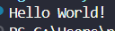
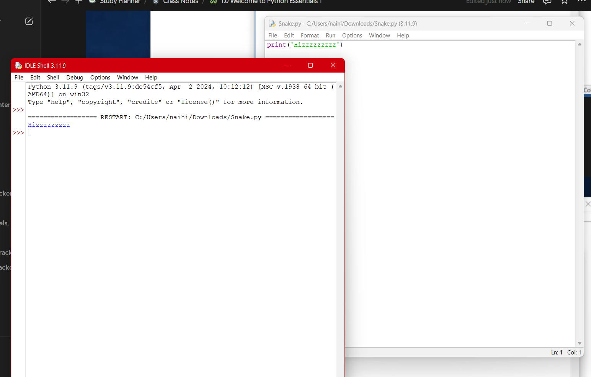

<div align="center">


<br/>

[](https://python.org)
[](LICENSE)
[](#curriculum)
[](#)

</div>

---

## About

This repository documents my journey learning Python from scratch.

From the very first `print("Hello, World!")` to building classes, handling files, and writing programs that actually do useful things — every file here represents a real step in my learning process. The notes and exercises are written the way I actually understood them, so if you're also starting out, hopefully they make sense to you too.

---

## Curriculum

13 chapters, each with its own documentation and runnable scripts.

| # | Chapter | Topics Covered |
|---|---------|----------------|
| 01 | **Python Basics** | `print()`, comments, Hello World |
| 02 | **Variables** | Data types, arithmetic operators, user input, type conversion |
| 03 | **Control Flow** | `if` / `elif` / `else`, relational operators, `random` module, logical operators |
| 04 | **Loops** | `while`, `for`, `range()`, f-strings, modulo, turtle graphics |
| 05 | **First Project** | Rock Paper Scissors · Rock Paper Scissors Lizard Spock |
| 06 | **Lists** | Indexing, slicing, built-in functions, list methods, iteration |
| 07 | **Functions** | `def`, parameters, return values, default args, scope, docstrings |
| 08 | **Dictionaries** | Key-value pairs, methods, nested dicts, iteration |
| 09 | **Tuples & Sets** | Immutability, unpacking, set operations (union, intersection, difference) |
| 10 | **String Methods** | Case, strip, find, replace, split, join, validation |
| 11 | **Error Handling** | `try` / `except`, `else`, `finally`, `raise`, common error types |
| 12 | **File Handling** | `open()`, `with`, read / write / append, CSV, `FileNotFoundError` |
| 13 | **OOP** | Classes, `__init__`, `self`, methods, `__str__`, inheritance, `super()` |

---

## What You'll Find

```
PythonForBeginers/
├── Documentation/           # Notes and explanations per chapter
│   ├── 01-00-Python-Basics.md
│   ├── 02-00-Variables.md
│   ├── 02-01-User-Input.md
│   ├── 03-00-Control-Flow.md
│   ├── ...
│   └── 13-01-OOP-Summary.md
│
└── PythonBasics/            # Runnable Python scripts per chapter
    ├── 01-Hellow-World/     → hello_world.py · initials.py · pattern.py
    ├── 02-Variables/        → temperature.py · bmi.py · currency.py · quadratic.py
    ├── 03-Control-Flow/     → grades.py · ph_levels.py · magic8.py · sorting_hat.py
    ├── 04-Loops/            → detention.py · fizz_buzz.py · 99_bottles.py · vowels.py
    ├── 05-First-Project/    → Rock-Paper-Scissors.py
    ├── 06-Lists/            → grocery.py · inventory.py · mixtape.py · bucket_list.py
    ├── 07-Functions/        → dry.py · tip_calculator.py · scope.py
    ├── 08-Dictionaries/     → coffee_shop.py · phonebook.py · nested_dict.py
    ├── 09-Tuples-Sets/      → capitals.py · playlists.py
    ├── 10-String-Methods/   → username_sanitizer.py · csv_parser.py
    ├── 11-Error-Handling/   → safe_division.py · safe_input.py
    ├── 12-File-Handling/    → journal.py · csv_writer.py
    └── 13-OOP/              → dog.py · student.py · bank_account.py
```

---

## Preview

<div align="center">



<br/>



</div>

---

## Tech Stack

<div align="center">

[](https://python.org)

</div>

---

## Getting Started

```bash
git clone https://github.com/JoshTVR/PythonForBeginers.git
cd PythonForBeginers
python PythonBasics/<chapter>/<script_name>.py
```

No external dependencies required — just Python 3.x.

Some scripts use modules from the standard library (`random`, `turtle`, `datetime`) — these ship with Python, no `pip install` needed.

---

<div align="center">

Every expert was once a beginner 🐍


</div>
